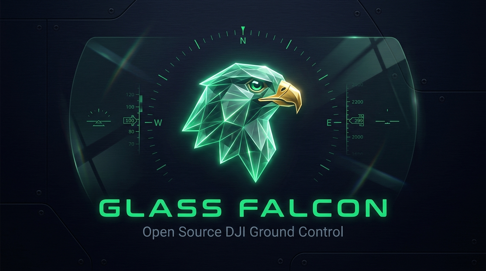

<p align="center">
  
</p>

<h1 align="center">GlassFalcon</h1>

<p align="center"><em>Vendor-independent ground control for DJI drones. No account, no cloud, no DJI SDK.</em></p>

<p align="center">
  
  
  
  
  
</p>

GlassFalcon is a clean-room, open-source Android ground-control app and SDK for DJI drones. It speaks the drone's native DUML protocol directly over USB, so an aircraft keeps flying without DJI's app, account, servers, or Mobile SDK. Nothing phones home.

**Why it exists.** DJI's standing in the US market is in doubt: import holds, entity-list actions, and pending legislation have made continued official US support uncertain. Owners of existing DJI hardware risk losing the app their aircraft depend on. GlassFalcon keeps those drones flyable on the owner's terms, independent of the vendor.

**Scope.** The target is DJI's lineup as a whole, not one airframe. DJI aircraft share the DUML protocol, differing per model in opcodes and telemetry layout, so the SDK is built to extend across models.

**What works today.** Only the **Mavic 2 Pro / Zoom (`wm240`)** is implemented and flight-tested, because it is the one aircraft the author owns. Every ✅ below is verified on a wm240; other models are the roadmap and need people who have those airframes (see [Contributing](#contributing)). The [Tested / Not-Tested](#tested--not-tested) section is the exact line between verified and unproven.

---

## Contents

- [Supported models](#supported-models)
- [Features](#features)
- [Tested / Not-Tested](#tested--not-tested)
- [Connecting](#connecting)
- [Install (signed APK)](#install-signed-apk)
- [Build (from source)](#build-from-source)
- [SDK](#sdk)
- [Hardware](#hardware)
- [Architecture and DUML](#architecture-and-duml)
- [Permissions](#permissions)
- [Known Limitations](#known-limitations)
- [Repo Structure](#repo-structure)
- [Contributing](#contributing)
- [Legal](#legal)

---

## Supported models

DJI aircraft share the DUML protocol but differ per model in opcodes, telemetry offsets, and USB IDs. Support is added one airframe at a time by capturing its dialect and filling in the per-model differences in the SDK.

| Model | Code | Status |
|---|---|---|
| Mavic 2 Pro / Zoom | `wm240` | ✅ implemented and flight-tested (the reference target) |
| Rest of the DJI lineup | various | ⬜ planned; each needs an owner of that airframe to capture and verify |

Porting a model means identifying its module IDs and telemetry layout, adding the per-model opcode differences, and verifying against the aircraft. If you own a DJI drone that DJI has walked away from, that is the hardware this project is for. See [Contributing](#contributing).

---

## Features

| Screen | What it does |
|---|---|
| **Flight HUD** | Live H.264 camera feed, emergency stop (tap-arm then confirm), guarded slide-to-arm takeoff/land, RTH, dual GPS readout (drone and phone), speed/altitude PFD tapes, heading compass, aircraft-referenced attitude indicator, obstacle radar, controller-button popups, live wind/gust pill |
| **Map** | Offline-capable MapLibre map, live drone position and heading, speed/altitude-colored flight trail, FAA airspace overlay (restricted/controlled zones plus the UAS Facility Map altitude grid), weather overlays |
| **Camera** | Embedded live viewer, photo capture, record toggle, ISO/shutter/EV/WB/anti-flicker, AF/MF, pinch-to-zoom (Mavic 2 Zoom) |
| **Gimbal** | Artificial-horizon attitude indicator, drag-to-aim plus double-tap recenter (speed control), mode switching (Follow / Lock / YawNoFollow), calibration |
| **Telemetry** | Full attitude, velocity, and GPS table |
| **Mission** | Grid/orbit mission builder with map preview, optional AI natural-language planning, battery-per-leg estimate |
| **Offload / Gallery** | Pull media over WiFi (drone AP) or ADB; on-phone gallery with select, share, filter, and sort |
| **AI Co-pilot** | Voice push-to-talk plus proactive callouts. Runs on on-device **Gemini Nano**, cloud **Gemini**, or a **Hybrid** mode where Nano routes commands and Gemini writes the answers. Fed live telemetry and weather. |
| **Voice** | Per-category mutable spoken callouts, on-demand full status read-out, voice and speed picker |
| **Device** | Ping/version/serial inquiry, FC info, per-module reboot, raw DUML hex console, FC tuning (sport boost, wind resistance), expert flight-limit controls |
| **Firmware** | Aircraft and RC firmware version display |
| **Plugins** | Optional add-on features with per-device enable, including the **encrypted live-stream** plugin |

**Plugins** are an in-app extension point for features not every pilot wants shipped on. The first is an end-to-end-encrypted re-streamer: it AES-256-GCM-encrypts each H.264 frame on the phone and relays it to a blind server that only ever sees ciphertext, viewable from an ephemeral link that burns itself when the stream ends. The server spec and a reference watch page are in [`plugins/encrypted-stream/`](plugins/encrypted-stream/). See [`plugins/`](plugins/) for how plugins are structured.

Settings screens open without a drone connected, the same way DJI GO 4 lets you review camera settings before a drone is linked. Individual controls still need a live link to reach the drone.

### Connection modes

| Mode | How | When to use |
|---|---|---|
| **USB direct (AOA)** | Plug the RC240 into the phone's USB port. The app auto-requests permission and streams DUML over Android Open Accessory. No DJI SDK, no servers, no account. | Primary path |
| **USB direct (CDC-ACM)** | Plug the **aircraft** into the phone/PC over USB. It enumerates as `/dev/ttyACM0` and talks to the flight controller as the DJI-Assistant "PC" identity. | Bench config, FC parameter tuning |
| **TCP** | Enter `IP:port` in the Connect dialog. | LAN bench testing, e.g. a PC-side DUML relay |
| **MSDK** (optional) | DJI Mobile SDK thin layer for USB auth only, if AOA does not enumerate. Needs your own `DJI_APP_KEY` in `local.properties`; the app ships with none and the dependency is inert without one. | Fallback only |

---

## Tested / Not-Tested

Legend: ✅ **Confirmed** (verified against real hardware) · ⚠️ **Unconfirmed** (framing known, effect not verified) · ❌ **Known-bad** (tried live, does not work or is actively harmful).

### DUML commands and behaviors

| Command / behavior | cmd_set/id | Status | Notes |
|---|---|:--:|---|
| Auto-takeoff trigger | `0x03` FunctionControl, val `0x01` | ✅ | Confirmed by real motor engagement plus a kprobe on `acc_write` |
| Auto-land trigger | `0x03/0x2a` | ⚠️ | Command is sent; the payload value that lands is unconfirmed. Manual stick landing works. |
| Return-to-Home | `0x03` | ✅ | |
| Beginner mode off | `0x03/0xf9` hash `0xde9b1b7b`=0 | ✅ | Captured off GO 4. Clears the beginner 30 m cap; the one limit write worth making. |
| 30 m cap: how it lifts | (aircraft-managed) | ✅ | The aircraft lifts it on its own GPS lock, self-recorded home, beginner-off, and activation. No phone GPS required: GO 4 flies the full envelope on a GPS-less, data-less iPad. The app's job is to not interfere. |
| Set Home Point | `0x03/0x31` | ❌ | **Re-locks the 30 m cap on wm240; never send it** (live-confirmed). The aircraft records its own home. |
| Send mobile GPS to FC | `0x03/0x20` | ✅ | Streams the phone's position for dynamic-home / follow-me. This is **not** what lifts the 30 m cap; the earlier claim that it was is a false-confirm. |
| Get Home Point | `0x03/0x44` | ✅ | Read-only; response is home lon/lat as radian doubles plus the FC serial |
| Max height / radius (read + write) | `0x03/0xf8` + `0xf9` hashes | ✅ | 500 m / 8000 m confirmed; persist across reboot |
| Index/hash config table (643 params) | `0x03/0xe0`-`0xe3` as PC `0x0a` | ✅ | Full FC parameter access (sport tuning, wind resistance, and the rest) |
| Gimbal aim (speed) | `0x04/0x0c` | ✅ | On-screen drag-to-aim plus double-tap recenter |
| Gimbal absolute angle | `0x04/0x0a` | ❌ | Ignored by wm240; use the speed command |
| Camera mode/focus/AE/settings | `0x02` (cmd_set) | ✅ | Belongs on cmd_set `0x02`, not `0x01` |
| Camera capture / record | `0x01` | ✅ | Ground-truth via the `0x80` state push |
| Optical zoom (Mavic 2 Zoom) | `0x01/0xb8` | ⚠️ | Built for the Zoom; a no-op on the Pro, untested on a real Zoom |
| OSD General decode (attitude/GPS/batt/sats) | `0x03/0x43` | ✅ | Full layout confirmed |
| FC attitude/heading push | `0x03/0x6c` (~50 Hz) | ✅ | |
| Obstacle radar, front/rear distance | `0x03/0x6a` | ✅ | bytes 1-2 = front, 5-6 = rear; 3-4 and 7-8 = unused 2nd beam; 9-12 = lateral (ActiveTrack only). Confirmed with a moving obstacle. |
| RC button map | `0x06/0x51` | ✅ | Both triggers plus the 5-way dial, one bit each |
| Low-battery force-land / RTH thresholds | `0x03/0xf9` hashes | ✅ | Driven to minimum so the FC will not fight the pilot home |
| PC-identity (`0x0a`) to lift the cap | n/a | ❌ | Red herring. The cap behaves identically on rooted and non-rooted phones; `0x0a` is only needed for the config-table protocol. |
| Waypoint missions | `0x24` upload / `0x26` enable / `0x27` suspend | ⚠️ | Cataloged, not yet flight-tested |
| RC buzzer | RC push | ⚠️ | Experimental. The RC240 has a beeper, no speaker, so phone TTS is used instead. |

### Non-obvious hardware behaviors

- A full aircraft internal storage ("eMMC full") drops the aircraft into a limited flight envelope on its own. Formatting internal storage in DJI GO 4's settings clears it. Many test flights can fill it.
- The 30 m cap is managed by the aircraft, not the app. It lifts on the aircraft's own GPS lock, self-recorded home, beginner-mode-off, and activation. No phone GPS is needed; GO 4 flies the full envelope on a GPS-less, data-less iPad. The one thing the app must not do is send `setHomePoint` (`0x03/0x31`), which re-locks it. Write beginner-mode off, then stay out of the way. The earlier "streaming phone GPS lifts the cap" conclusion was a false-confirm: phone GPS was streaming in both the capped and uncapped states.
- The RC240-to-phone link is USB Accessory (AOA), not host-CDC/RNDIS. The aircraft-direct path (CDC-ACM `/dev/ttyACM0`) is a separate bench link.

### Feature test status

✅ verified on real hardware · 🧪 built, not yet flight/use-tested · 🛠 partial. A feature is marked ✅ only after it has been exercised on the aircraft.

| Feature | Status |
|---|:--:|
| Takeoff (one-tap) / RTH / manual stick landing | ✅ |
| Full altitude and distance envelope (past 30 m) | ✅ |
| Live H.264 video and camera controls | ✅ |
| Gimbal drag-to-aim | ✅ |
| Gimbal double-tap recenter (speed-slew) | 🧪 |
| Telemetry / HUD / attitude indicator | ✅ |
| Obstacle radar, data | ✅ |
| Obstacle radar, directionality centering (new) | 🧪 |
| Map and FAA airspace overlays | ✅ |
| AI co-pilot, Nano push-to-talk | ✅ |
| AI co-pilot, cloud Gemini / Hybrid | 🧪 |
| Voice callouts (basic) | ✅ |
| Tunable per-category callouts and status read-out | 🧪 |
| Voice and speed picker | 🧪 |
| Weather-aware co-pilot context | 🧪 |
| Grid / orbit missions | 🛠 partially flown |
| Gallery (browse / select / share) | 🧪 |
| Media offload (WiFi / ADB) | 🧪 |
| Plugin system | 🧪 |
| Encrypted live-stream plugin | 🧪 (phone side built; server relay is user-provided) |

### Firmware seen

| Aircraft | Aircraft FW | RC FW | Status |
|---|---|---|---|
| Mavic 2 Pro + RC240 (primary dev unit) | not recorded | not recorded | ✅ primary test aircraft |
| Mavic 2 Zoom (a friend's) | `01.00.0797` | `01.00.0770` | ⚠️ versions read off a screenshot only, not yet probed for zoom/lockdown deltas |

---

## Connecting

1. Power on the RC240 and wait for it to finish booting (~15 s).
2. Plug the RC240 into the phone's USB-C port. GlassFalcon launches automatically and requests accessory permission.
3. Tap **Allow** (optionally check "always").
4. Power on the drone. Telemetry and video start within a few seconds. Let the aircraft get a solid GPS lock on the ground before takeoff: it lifts its own 30 m altitude cap once it has GPS plus a recorded home (which it self-records), with beginner mode off.

If the AOA permission dialog does not appear, try a different cable or port, or fall back to the MSDK connection mode above.

---

## Install (signed APK)

Grab the latest signed APK from [Releases](https://github.com/sworrl/GlassFalcon/releases). No build toolchain needed.

Verify it before flashing, both integrity and authenticity:

```bash
# 1. integrity: matches the published checksum (SHA256SUMS.txt in the release)
sha256sum GlassFalcon-*.apk

# 2. authenticity: signed by the project key (the same cert on every release)
apksigner verify --print-certs GlassFalcon-*.apk
#    expect  certificate SHA-256:  7d6c56f133e882149009fc0531adcff73d4b764f97fcc0e4dbcbbd39a23f1b4c
```

If the cert fingerprint does not match that value, do not install it. It was not signed by this project.

Flash it (enable USB debugging, connect the phone):

```bash
# one command: fetches the latest release APK (and adb if you don't have it), then installs
./tools/install.sh

# or directly
adb install -r GlassFalcon-*.apk
```

The signed release installs as `dev.glassfalcon`. A locally-built debug APK installs as `dev.glassfalcon.debug`, so the two coexist.

## Build (from source)

```bash
git clone https://github.com/sworrl/GlassFalcon.git
cd GlassFalcon/android

./gradlew assembleDebug
adb install app/build/outputs/apk/debug/*.apk
```

Requirements: Android SDK 34+, the included Gradle wrapper, a device on Android 8.0 (API 26) or newer.

Optional MSDK fallback key:

```bash
echo "DJI_APP_KEY=your_key_here" >> android/local.properties
```

The release build ships one ABI (`arm64-v8a`) and does not run on x86 emulators. Add `"x86_64"` to `abiFilters` in `app/build.gradle.kts` if you want emulator builds. R8/minify is off because this AGP's R8 cannot parse Kotlin 2.2 metadata yet; the release APK is signed but not shrunk.

---

## SDK

The DUML implementation is a reusable library, independent of the app:

| Component | Path | What |
|---|---|---|
| **Python SDK** | [`sdk/python`](sdk/python) | `glassfalcon` package, pip-installable, pure stdlib |
| **Android SDK** | [`android/sdk`](android/sdk) | `:sdk` Gradle module producing `sdk-release.aar` (DUML framing, telemetry decode, mission planning, no UI) |
| **Docs** | [`sdk/docs`](sdk/docs) | [Protocol reference](sdk/docs/protocol.md) · [Getting started](sdk/docs/getting-started.md) |

```bash
pip install -e sdk/python
```

```python
from glassfalcon import DUMLConnection, TelemetryDecoder, duml_cmds as C

conn = DUMLConnection.open_serial("/dev/ttyACM0")
dec = TelemetryDecoder()
conn.add_listener(dec.feed)
conn.send_cmd(C.get_device_state())
print(dec.state.battery_pct, dec.state.gps_sats, dec.state.lat, dec.state.lon)
```

The Android `:sdk` module mirrors the same protocol, telemetry, and mission logic in Kotlin (`Duml.kt`, `DumlCommands.kt`, `Telemetry.kt`, `MissionEngine.kt`).

```bash
cd android && ./gradlew :sdk:assembleRelease   # -> sdk/build/outputs/aar/sdk-release.aar
```

Licensed GPL-3.0-or-later ([`LICENSE`](LICENSE)).

---

## Hardware

The currently supported aircraft:

| Property | Value |
|---|---|
| Drone | DJI Mavic 2 Pro / Zoom |
| Model code | **wm240** |
| USB VID:PID | `2ca3:001f` (drone), `2ca3:0015` (RC240 as USB accessory) |
| Remote | RC240 |

Other DJI models identify with their own model code and USB IDs; adding one starts by capturing its DUML dialect. See [Supported models](#supported-models) and [Contributing](#contributing).

```bash
./tools/find-drone.sh   # read-only USB/serial detection helper, run after plugging in
```

---

## Architecture and DUML

Three layers: Compose UI plus `FlightViewModel`, then the `:sdk` (DUML framing, telemetry, mission), then transport. The SDK carries no Android UI dependency, which is why the same protocol code also ships as a Python package. The full wire-format reference and the running findings/gaps log are in [`sdk/docs/protocol.md`](sdk/docs/protocol.md).

### Transport

| Link | Path | Carries |
|---|---|---|
| RC240 to phone | Android Open Accessory (USB accessory, `2ca3:0015`) | DUML plus H.264, multiplexed |
| Aircraft to phone/PC | CDC-ACM serial `/dev/ttyACM0`, 115200 8N1 | raw DUML |
| PC relay / bench | TCP `IP:port` | raw DUML |

Over AOA the RC wraps everything in an outer `55 cc` frame; an inner two-byte type picks the sub-stream. `49 57` is DUML telemetry, `4a 57` is H.264 video. `Duml.dispatchAoaAcc` demuxes on that pair, routing telemetry to `TelemetryDecoder` and video payloads to `VideoDecoder`.

### DUML frame

```
55 │ LL Lv │ HC │ SRC DST │ SEQ SEQ │ CS CI │ payload… │ C16 C16
│    │       │     │   │      │        │  │              └── CRC-16 (poly 0x3692), whole frame
│    │       │     │   │      seq      │  cmd_id
│    │       │     │   │               cmd_set
│    │       │     src/dst device IDs (below)
│    │       └── CRC-8 (init 0x77) over the first 3 bytes
│    └── 10-bit length plus 6-bit protocol version
└── start byte 0x55
```

Device IDs: FC `0x03`, camera `0x01`, gimbal `0x04`, RC `0x06`, mobile app `0x02`, PC/Assistant `0x0a`. Most commands go out as `0x02`. The FC config-table protocol is only honored from `0x0a` (`Duml.sendAs`).

### Telemetry: OSD General (`0x03/0x43`, ~10 Hz)

Little-endian layout GlassFalcon decodes (`Telemetry.feed`):

| Offset | Field | Type |
|--:|---|---|
| 0 / 8 | longitude / latitude | f64, radians |
| 16 | height above ground | i16, 0.1 m |
| 18-22 | velocity N / E / D | i16, 0.1 m/s |
| 24-28 | pitch / roll / yaw | i16, 0.1° |
| 30 | `flyc_state` (low 7 bits); `0x80` = no RC | u8 |
| 32 | `controller_state` bitfield | u32 |
| 36 | GPS satellites | u8 |
| 38 | motor start-fail reason (low 7 bits) | u8 |
| 40 | battery % | u8 |

`controller_state` bits in use: `0x04` in-air, `0x08` motors on, `0x8000` GPS-used, `(x & 0x3C0000) >> 18` GPS signal level, `0x400` battery-requires-land, plus ESC-stall / ESC-empty / baro / ultrasonic fault bits. Bit `0x1000` ("IMU preheating") exists but reads as stuck garbage, so it is not surfaced (see the [Tested](#tested--not-tested) section).

### FC parameters: two addressing schemes

- **By name-hash.** `0x03/0xf7` info, `0xf8` read, `0xf9` write. Each parameter is addressed by a 32-bit hash of its name (for example `max_height` `0x0371238a`, `max_radius` `0x425c0a94`, beginner-mode `0xde9b1b7b`).
- **By index.** `0x03/0xe0`-`0xe3`, sent as PC `0x0a`. This enumerates all ~643 config-table params by index with name plus min/max/type, then reads and writes by index. It reaches sport-mode tuning, wind resistance, and the rest of the table without needing each hash.

### Video

`4a 57` payloads are Annex-B H.264. `VideoExtractor` strips DJI's proprietary SEI NAL types (`0x55`, `0xf0`, `0xba`, `0xff`) and any embedded DUML frames, groups the clean NALs into whole access units, and `VideoDecoder` feeds them to `MediaCodec` rendering onto a `TextureView`. That same clean access-unit stream is the tap point for the encrypted-stream plugin.

---

## Permissions

| Permission | Why | Optional? |
|---|---|:--:|
| USB accessory (runtime grant, no manifest permission) | the RC240 AOA link | required |
| `ACCESS_FINE_LOCATION` | phone GPS for the map "you are here", the dynamic-home stream, and nearby-airspace lookups | yes; flight control works without it |
| `INTERNET` | weather (Open-Meteo, keyless), FAA airspace tiles, optional cloud AI, optional encrypted stream | yes; core flight, camera, and telemetry are offline |

No analytics, no crash reporting, no phone-home. Every outbound connection maps to a feature you can leave off.

---

## Known Limitations

- The auto-land button sends a real DUML command (`0x03/0x2a`), but the payload value that triggers landing on wm240 is unconfirmed (auto-takeoff's value `0x01` is confirmed). Manual stick landing works today.
- The lateral obstacle channels (C/D) only populate in low-speed ActiveTrack, so their left/right assignment is not independently confirmed. Front/rear distance is confirmed. The wm240's front/rear sensors have no left/right sub-resolution within an arc; the second beam per direction is unused hardware.
- Waypoint missions are cataloged but not yet flight-tested.
- OpenAIP (the global airspace baseline) is not yet integrated. Only FAA US airspace layers are live.

Contributions on any of these are welcome.

---

## Repo Structure

```
GlassFalcon/
├── android/
│   ├── sdk/                      # :sdk library module -> sdk-release.aar
│   │   └── src/main/kotlin/dev/glassfalcon/core/
│   │       ├── Duml.kt            # DUML framing + USB accessory/CDC-ACM transport
│   │       ├── DumlCommands.kt    # Camera/FC/Gimbal command builders
│   │       ├── Telemetry.kt       # FC broadcast decoder + DroneState
│   │       ├── VideoExtractor.kt  # H.264 NAL extraction from the multiplexed downlink
│   │       ├── MissionPlanner.kt  # Grid survey, orbit, battery model
│   │       └── MissionEngine.kt   # Coroutine mission state machine
│   └── app/src/main/kotlin/dev/glassfalcon/
│       ├── core/                  # FlightViewModel, VideoDecoder, Weather, RcButtons
│       │   ├── NanoCopilot / GeminiCoPilot / VoiceAnnouncer   # on-device + cloud AI, TTS
│       │   └── plugin/            # plugin registry + stream/ (encrypted re-streamer)
│       └── ui/                    # screens/, GlassFalconRoot.kt, Theme.kt
├── sdk/
│   ├── python/                    # `glassfalcon` pip package (pure stdlib)
│   └── docs/                      # protocol.md, getting-started.md
├── plugins/                       # plugin server/companion halves (encrypted-stream/) + plugins/local/ (gitignored)
├── tools/                         # install.sh / install.ps1, find-drone.sh, phone.sh
├── assets/                        # icons, banner
└── LICENSE                        # GPL-3.0-or-later
```

---

## Contributing

Issues and PRs welcome. Two kinds of contribution move this forward most:

- **A new airframe.** If you own a DJI drone other than the wm240, capturing its DUML dialect (module IDs, telemetry offsets, opcode differences) is the work that extends support to it. Open an issue with the model and what you can capture.
- **Filling the wm240 gaps.** Progress on the auto-land opcode, waypoint missions, or the lateral obstacle channels is welcome; see [Known Limitations](#known-limitations) and the [Tested / Not-Tested](#tested--not-tested) section for exactly what is open.

---

## Legal

This project is a clean-room implementation of the DUML protocol for interoperability with hardware you own, built from empirical protocol observation (captured bytes, documented behavior), not from DJI's copyrighted source or decompiled binaries. It does not distribute DJI firmware, proprietary keys, or DJI SDK components.

GlassFalcon is free, open-source software with no company, server, account system, or monetization behind it. Nothing in it, and no one, can verify what certifications, waivers, or local authorizations you hold to operate an aircraft in any given airspace, at any given height, in any given country.

Because of that, GlassFalcon does not try to enforce compliance. Any limit it shows you (your aircraft's own configured height/radius limits, nearby FAA airspace ceilings, anything else) is informational, pulled from the aircraft's own reported settings or public data. None of it is a guarantee, and none of it is a lock GlassFalcon puts between you and your own aircraft.

**You are solely responsible for complying with all laws and regulations that apply wherever you operate your aircraft** (FAA Part 107, EU UAS regulations, and so on). You, not GlassFalcon and not its authors, are accountable if you do not. The app shows this same disclaimer once on first launch.

### Fonts

GlassFalcon bundles [Space Grotesk](https://github.com/floriankarsten/space-grotesk) (UI labels) and [IBM Plex Mono](https://github.com/IBM/plex) (numeric HUD readouts), both under the [SIL Open Font License 1.1](https://openfontlicense.org/).

GlassFalcon is licensed GPL-3.0-or-later; see [`LICENSE`](LICENSE).
